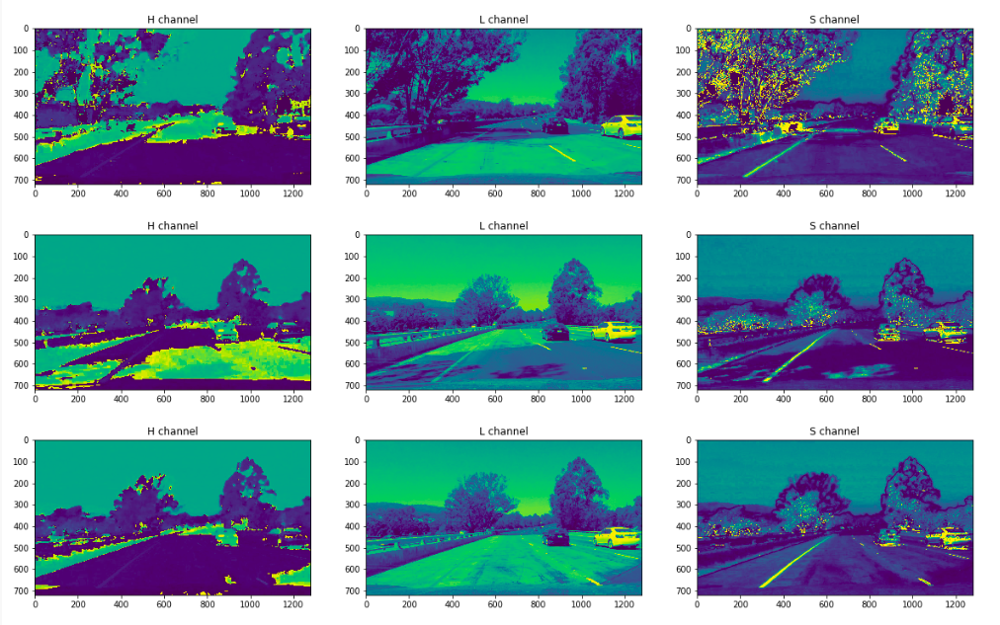
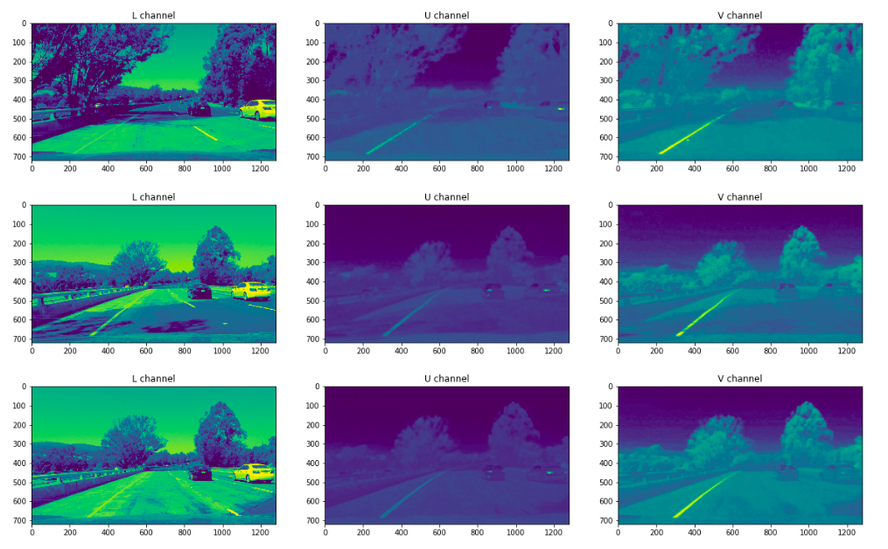
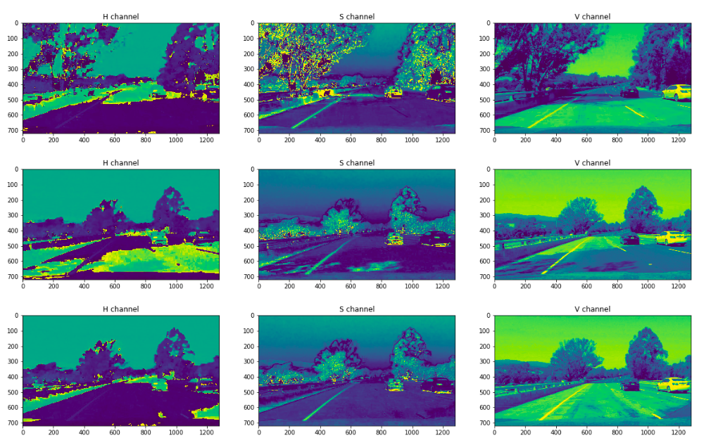
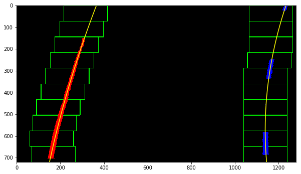

## Advanced Lane Finding

In this project, our goal is to write a software pipeline to identify the lane boundaries in a video like shown below in the gif.

## Administrative Stuff
- All the code for the pipeline is present in [P2.ipynb](P2.ipynb) file. If you prefer watching on the browser, I suggest checking the html [(P2.html)](P2.html) version of the same notebook.
- The project video is named [project_video_output.mp4](https://youtu.be/izcRpUbAXnk).

Steps in the Pipeline
---

- Compute the camera calibration matrix and distortion coefficients given a set of chessboard images.
- Apply a distortion correction to raw images.
- Use color transforms to create a thresholded binary image.
- Apply a perspective transform to rectify binary image ("birds-eye view").
- Detect lane pixels and fit to find the lane boundary.
- Determine the curvature of the lane and vehicle position with respect to center.
- Warp the detected lane boundaries back onto the original image.
- Output visual display of the lane boundaries and numerical estimation of lane curvature and vehicle position.

Let's look at each of the points mentioned above in detail and how we got to display lane lines on the project video.

## Camera Calibration

We begin by calibrating the camera. The cameras that we use tend to generate some sort of distortions to the original images depending on a lot of factors thus deforming the shapes. However, the deformity caused can be eliminated by performing some operations with the help of constants which are a matrix and some coefficients.

It turns out that the deformities are constant and hence the above method works well.

## Undistortion

In the previous step, we calibrated our camera; it is time we test our results on the images we have.  
First let us try with one of the images that we used for calibrating the camera. The undistortion seems to work very well with the curved corners getting straightened. However, it is obvious that the results would be good considering the calibration was done on the same set of images.

Now, we if try the same distortion removal on the images of the lane lines, we might probably be able to test the working of the distortion removal algo better. So, as we can see below, it might seem at first that there is no major difference in the orginal image and the undistorted image, but if we look at the hood of the car, the curved look seems to have flattened/straightened a bit. To visualize better, one can imagine a boomerang straghtened.  
This slight change in orientation is useful when in the future we warp the images and try to generate a trapeziodal shaped region of interest where the lane is highlighted. The accuracy is improved.

## Color Spaces and Gradients

**HLS**

**LUV**

**HSV**

## Perspective Transform

## Fit lines sliding window algo

## Drawing Lane Lines

## Discussion
### Potential shortcomings with the current pipeline
__Lighting conditions__  

Though there is an improvement over the previous algorithm where we only fit straight lines, it is evident by looking at the harder challenge videos that the current pipeline fails to catch sudden changes in lighting conditions. 
Even with this approach, the number hyper parameters used was considerably high and the color space and gradient finding methods took a lot of time and effort and the results are still not satisfactory.

### Possible improvements

