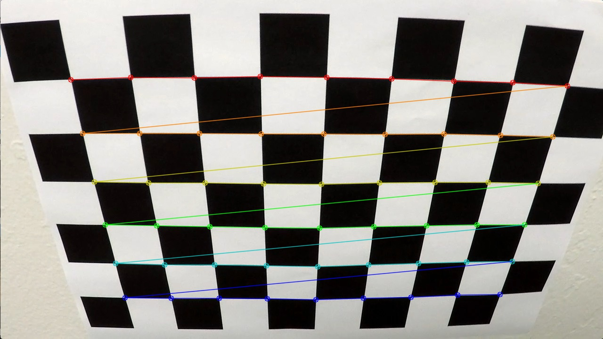
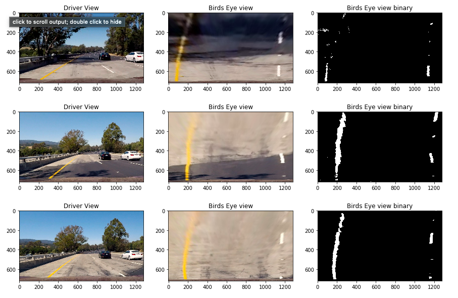
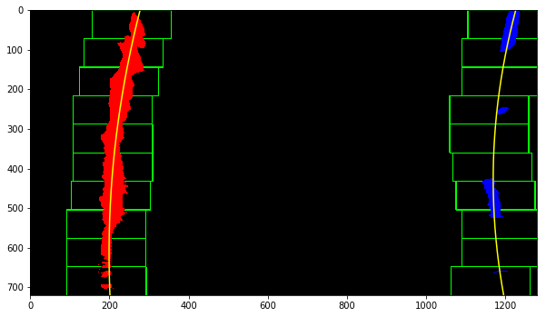
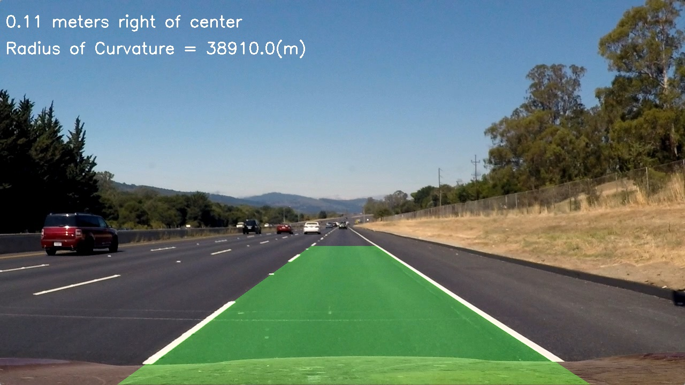

## Advanced Lane Finding

In this project, our goal is to write a software pipeline to identify the lane boundaries in a video like shown below in the gif.

## Administrative Stuff
- All the code for the pipeline is present in [P2.ipynb](P2.ipynb) file. If you prefer watching on the browser, I suggest checking the html [(P2.html)](P2.html) version of the same notebook.
- The project video is named [project_video_output.mp4](https://youtu.be/izcRpUbAXnk).

Steps in the Pipeline
---

- Compute the camera calibration matrix and distortion coefficients given a set of chessboard images.
- Apply a distortion correction to raw images.
- Use color transforms to create a thresholded binary image.
- Apply a perspective transform to rectify binary image ("birds-eye view").
- Detect lane pixels and fit to find the lane boundary.
- Determine the curvature of the lane and vehicle position with respect to center.
- Warp the detected lane boundaries back onto the original image.
- Output visual display of the lane boundaries and numerical estimation of lane curvature and vehicle position.

Let's look at each of the points mentioned above in detail and how we got to display lane lines on the project video.

## Camera Calibration

We begin by calibrating the camera. The cameras that we use tend to generate some sort of distortions to the original images depending on a lot of factors thus deforming the shapes. However, the deformity caused can be eliminated by performing some operations with the help of constants which are a matrix and some coefficients.

It turns out that the deformities are constant and hence the above method works well.

## Undistortion

In the previous step, we calibrated our camera; it is time we test our results on the images we have.  
First let us try with one of the images that we used for calibrating the camera. The undistortion seems to work very well with the curved corners getting straightened. However, it is obvious that the results would be good considering the calibration was done on the same set of images.

Now, we if try the same distortion removal on the images of the lane lines, we might probably be able to test the working of the distortion removal algo better. So, as we can see below, it might seem at first that there is no major difference in the orginal image and the undistorted image, but if we look at the hood of the car, the curved look seems to have flattened/straightened a bit. To visualize better, one can imagine a boomerang straghtened.  
This slight change in orientation is useful when in the future we warp the images and try to generate a trapeziodal shaped region of interest where the lane is highlighted. The accuracy is improved.

## Color Spaces and Gradients
Finding the correct combination of color spaces and gradients is the most time consuming and imperatively the most important task in this project.  
There were 2 types of lane lines,  
1. __Yellow lines__ (solid and usually continuous)
2. __White lines__ (solid but usually discontinuous and faint)

To start with I tried with several combinations of color spaces and gradients in the x direction to finding only the vertical edges. However, even with a lot of fine tuning, I ended up with not so interesting results. I even tried taking x gradients for particular channels to extract the white lane lines as they were the most difficult to find out between the 2 listed above. With the S channel of the HLS color space, I could easily extract the yellow lane lines. However, to highlight the white lane lines and to combine well with bitwise or'ed S channel of HLS, I used the V channel from the HSV color space.  
LUV color space's L showed some promise but the V from the HSV did a better job in conditions of higher brightness.

Below are some of the results of HLS, LUV and HSV color spaces.

**HLS**

**LUV**

**HSV**

## Perspective Transform

**What is a Perspective Transform?**  
Simply put, the perspective transform is just a change in the viewing angle. Suppose a person is driving a car on lane. The way the driver looks at the lane he is driving on is different from the person who is on the side seat as well as the back seats. So, each of these cases, certain person might have better view of what lies ahead. For example, the driver might have a better view of curves that are ahead of them. However, if imagine a bird watching over the road from above, it would have an even better view of the road ahead. So, these are ways by which a single road/lane can be viewed from different angles.

**Whats the use?**  
We use the best of worlds to choose what action to take further. (Note: We are not taking action in this part of the project, but will definitely later.) So, by viewing using a birds-eye view i.e. top view, we can estimate that there are curves ahead better than just viewing from the driver's perspective. We will view some images of the drivers and the birds view of the same road.

**Q. How do we use it in our pipeline?**  
We binarize the image using some thresholds and finally what we get is lane lines from the top view. We then use these lines to decide if the line is straight, or turns left or right. And depending upon that we fit polynomials that will draw straight lines or curves onto the original image. Simply put, these lines will be drawn based on coordinates and hence in the further projects, we can train the car or simulator to stay within these points.

Below is a sample of how the image looks originall, transformed using a birds-eye view and finally the binary representation of the birds-eye view.

Below are the configurations we use to convert from the original image to the rectangle we obtain to viewing from the top i.e. the birds-eye view.

|  Source  |Destination|  Position  |
|----------|-----------|------------| 
|(180,720) | (100,720) | bottom-left|
|(560,460) |   (0,0)   |  top-left  |
|(740,460) | (1300,0)  |  top-right |
|(1200,720)| (1200,720)|bottom-right|

## Drawing Lane Lines and measuring Radius of Curvature

**Sliding Window Algorithm**  
The __algorithm__ to draw lane lines using the sliding window algorithm is as follows:
- Using a histogram, we find the top two peaks in an image. The histogram is then separated into left and right to individually tackle the left and right lane lines
- The pixel positions/indices are calculated and are used by the polygon fitting algorithm to draw lines on the warped image.
- Finally, the warped image is unwarped using the Inverse transform (MInv) that we obtained before.
- For each of the frames, we decide on the margin and using the margin draw a rectangle by finding pixel postions to the left and right and top and bottom.  
Below are sample images that are used to plot the lines as well as the windows

**Lane Lines**  
Now, the tricky part is, getting the left and right lane pixels with above algorithm is costly with respect to number of operations. So, we maintain a __Line__ class to keep track on whether this is the first time we are finding the lane pixels. If the lane pixels have been found previously, we use that data to average out as there is not much difference in the lane lines between 2 consecutive frames. Also, if the lane lines are lost and couldn't be calculated for a threshold set of times, we revert back to the above algorithm to finding the pixels from scratch.

**ROC**  
Throughout the video, most of the frames have straight lines and as a result the radius of curvature seems to be higher. However, on curved roads, it seems to have reduced hugely and the algorithm still works which is sign of a moderately well formed algorithm :)

We use the below formula that we also used in the classroom to calculate the radius of curvature for a function __y = f(x)__, 

However, the above value was calculated for each of the left and right lanes and later averaged so that the lines remain consistent and parallel to each other at a certain point in a frame.

Below is an image of how a particular frame with lane lines drawn and radius of curvature calculated and distance from the margin calculated looks like.

## Discussion
### Potential shortcomings with the current pipeline
__High Brightness conditions__: Though there is an improvement over the previous algorithm where we only fit straight lines, it is evident by looking at the harder challenge videos that the current pipeline fails to catch sudden changes in lighting conditions.    
__Parameters__: Even with this approach, the number of parameters used was considerably higher and the color space and gradient finding methods took a lot of time and effort and the results are still not satisfactory.

### Possible improvements
__High Brightness conditions__: I looked into some of the background remove techniques to detect and eliminate the shadows which are the major contributors to the algorithm failing with the current pipeline. The techniques did not seem robust to me and they focused on removing the background when a corresponding foreground object was present. I however, am interested in detecting the shadows when the actual object casting it is not in the frame. It feels like brute estimation of shadows but I am sure there must be more to it where some algorithm can learn that it is the shadows and not something relevant to the frame.    
__Parameters__: I am aware of some literature in the deep learning domain and I am pretty sure, the edge detection can be learned by intermediate layers of a CNN well and the shadow estimation too can be done well. This will help our algorithm to seamlessly draw the lane lines with less trouble.
